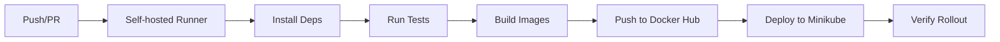

# CI/CD Flow

## Diagram

## Explanation

- Push or PR triggers the self-hosted runner.
- The runner installs dependencies and runs unit/integration tests.
- Docker images are built and pushed to Docker Hub.
- The deployment script applies Kubernetes manifests in Minikube.
- Rollout is verified by checking pod status.
